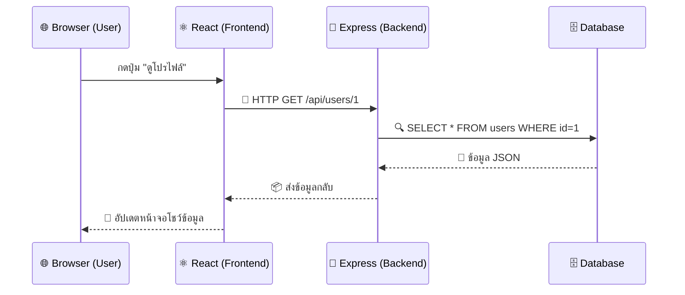

# 📚 Session 1: Web Flow + React Refresher

**เวลา:** 09:00 - 10:30 | Understanding the Big Picture

---

## 🛠️ สิ่งที่ต้องเตรียมและติดตั้งในเครื่อง (Prerequisites)

ก่อนเริ่ม Session 1 ผู้เรียนทุกคนจะต้องมีโปรแกรมเหล่านี้ติดตั้งอยู่ในเครื่อง:

1. **Node.js** (เวอร์ชัน 18 LTS ขึ้นไป) - สำหรับรัน JavaScript ฝั่งเซิร์ฟเวอร์และเครื่องมือจัดการแพ็กเกจ (npm)
   - 🔗 [ดาวน์โหลด Node.js](https://nodejs.org/)
   - ✅ **วิธีตรวจสอบ:** เปิด Terminal หรือ Command Prompt แล้วพิมพ์คำสั่ง `node -v` และ `npm -v` (จะต้องเห็นตัวเลขเวอร์ชัน เช่น `v18.x.x` และ `9.x.x`)
2. **Visual Studio Code (VS Code)** - Code Editor หลักที่ใช้ในเวิร์กชอป
   - 🔗 [ดาวน์โหลด VS Code](https://code.visualstudio.com/)
   - ✅ **วิธีตรวจสอบ:** ค้นหาโปรแกรม Visual Studio Code ในเครื่องและลองกดเปิดใช้งาน เพื่อยืนยันว่าติดตั้งสำเร็จ
   - _Extensions ที่แนะนำให้ลงใน VS Code:_
     - `ES7+ React/Redux/React-Native snippets` (พิมพ์โค้ด React ไวขึ้น)
     - `Tailwind CSS IntelliSense` (ช่วย Auto-complete คลาสของ Tailwind)
     - `Prettier - Code formatter` (จัดฟอร์แมตโค้ดอัตโนมัติ)
3. **Web Browser** แนะนำ Firefox หรือ Google Chrome (พร้อมกับลง React Developer Tools Extension)
   - 🔗 [ดาวน์โหลด Google Chrome](https://www.google.com/chrome/)
   - 🔗 [React Developer Tools สำหรับ Chrome](https://chromewebstore.google.com/detail/react-developer-tools/fmkadmapgofadopljbjfkapdkoienihi)

---

## 💻 Commands ที่ใช้ตั้งค่าโปรเจกต์ (Setup Commands)

เราจะสร้าง React App ด้วย **Vite** (ไวกว่า Create React App แบบเก่ามาก) รวมถึงลง Tailwind CSS และ DaisyUI

ให้เปิด Terminal หรือ Command Prompt แล้วรันคำสั่งตามลำดับ:

```bash
# 1. สร้างโปรเจกต์ React โดยใช้ Vite (ตั้งชื่อโฟลเดอร์ว่า frontend)
npm create vite@latest frontend -- --template react

# 2. ย้ายเข้าไปในโฟลเดอร์ที่เพิ่งสร้าง
cd frontend

# 3. ติดตั้ง Dependencies พื้นฐานที่ Vite เตรียมไว้ให้
npm install

# 4. ติดตั้ง Tailwind CSS และสร้างไฟล์ Config
npm install -D tailwindcss postcss autoprefixer
npx tailwindcss init -p

# 5. (ทางเลือก) ติดตั้ง DaisyUI เพื่อใช้ UI Component สำเร็จรูป (ปุ่ม, การ์ด, Modal)
npm i -D daisyui@latest

# 6. ทดสอบรันเซิร์ฟเวอร์ React (จะเปิดหน้าเว็บได้ที่ http://localhost:5173)
npm run dev
```

_(หมายเหตุ: หลังจากรันข้อ 4 อย่าลืมไปตั้งค่า `tailwind.config.js` และ `index.css` ตาม Document ของ Tailwind)_

---

## 📦 รู้จักกับ `package.json` (หัวใจสำคัญของโปรเจกต์ Node.js)

ไฟล์ `package.json` เป็นเหมือน "บัตรประชาชน" และ "สมุดบันทึก" ของโปรเจกต์เรา จะถูกสร้างขึ้นมาอัตโนมัติเมื่อเราใช้คำสั่ง `npm init` หรือตอนสร้างโปรเจกต์ด้วยเครื่องมืออย่าง Vite หลักๆ แล้วมันจะเก็บข้อมูล 3 ส่วนสำคัญ:

1. **ข้อมูลทั่วไปของโปรเจกต์ (Metadata):** เช่น ชื่อโปรเจกต์ (`name`), เวอร์ชัน (`version`), และคำอธิบาย (`description`)
2. **สคริปต์คำสั่งรัด (Scripts):** เอาไว้สร้างคำสั่งสั้นๆ เพื่อรันคำสั่งยาวๆ เช่น เราพิมพ์แค่ `npm run dev` แต่มันไปเรียกคำสั่ง `nodemon index.js` หรือคำสั่งของ Vite ที่ทำงานซับซ้อนให้เราทันที
3. **รายชื่อ Package ที่โปรเจกต์เราต้องใช้ (Dependencies):**
   - `dependencies`: ของที่จำเป็นต้องใช้ตอนเอาแอปไปรันจริง (เช่น `react`, `express`, `cors`)
   - `devDependencies`: ของที่ใช้แค่ตอนเรากำลังพัฒนาแอป (Dev) (เช่น `nodemon`, `vite`, `tailwindcss`)

**💡 ทำไมถึงสำคัญ?**
เวลาเราส่งโปรเจกต์ให้เพื่อนในทีม หรือเอาขึ้น GitHub ยอดฮิตคือเรา **จะไม่ส่ง** โฟลเดอร์ `node_modules` (โฟลเดอร์ที่เก็บโค้ดของ Library ทั้งหมด) ไปด้วย เพราะมันใหญ่มากๆ (เป็นร้อยๆ MB)
เราจะส่งแค่โฟลเดอร์โค้ดของเรากับไฟล์ `package.json` ไปให้เพื่อน พอเพื่อนเปิดโปรเจกต์ปุ๊บ แค่รันคำสั่ง `npm install` (หรือ `npm i`) ตัว npm จะไปอ่านไฟล์ `package.json` และช่วยดาวน์โหลด Library ทั้งหมดกลับมาให้ครบถ้วนในพริบตา!

---

## 1️⃣ How Web Apps Work (ภาพรวมการทำงานของเว็บแอปพลิเคชัน)

**Flow การทำงานของ Modern Web App:**

1. **Browser (Client):** ด่านหน้าที่ผู้ใช้งานเห็น
2. **React (Frontend):** ตัวจัดการ UI เมื่อผู้ใช้กระทำบางอย่าง (เช่น กดปุ่ม) จะส่ง Request
3. **Express (Backend):** รับคำขอผ่าน REST API, ตรวจสอบสิทธิ์, และประมวลผลโลจิก
4. **Database (Data Layer):** บันทึกหรือดึงข้อมูลตามคำสั่งจาก Express
5. **Express -> React -> Browser:** ข้อมูลถูกส่งกลับมาเป็นชิ้น (JSON Format) ให้ React อัปเดตหน้าจอโดยไม่ต้องรีเฟรชทั้งหน้า

### 📊 Diagram เชื่อมต่อ



---

## 2️⃣ React Recap: Core Concepts

ทบทวนหัวใจสำคัญ 4 อย่างของ React ในการทำงานร่วมกับ Backend พร้อมตัวอย่างโค้ดคร่าวๆ

### 1. Component & Props

โครงหน้าเว็บถูกแบ่งเป็นชิ้นๆ (Component) และส่งต่อข้อมูลด้วย (Props)

```jsx
// ตัวอย่าง Child Component ที่รับ Props ชื่อ name และ role
function UserCard({ name, role }) {
  return (
    <div className="card bg-base-100 shadow-xl p-4">
      <h2 className="text-xl font-bold">{name}</h2>
      <p className="text-gray-500">{role}</p>
    </div>
  );
}

// ตัวอย่าง Parent Component
function App() {
  return (
    <div className="flex gap-4 p-5">
      <UserCard name="สมชาย" role="Admin" />
      <UserCard name="สมหญิง" role="User" />
    </div>
  );
}
```

### 2. State & Effect (การต่อ API เบื้องต้น และ CRUD)

- **State (`useState`):** กล่องเก็บข้อมูล เมื่อค่าเปลี่ยน UI จะเปลี่ยนตาม
- **Effect (`useEffect`):** จัดการ Side Effects เช่น การต่อ API เมื่อหน้าเว็บโหลดขึ้นมาครั้งแรก
- **CRUD Operations:** การยิง `fetch()` ด้วย Method อื่นๆ (POST, PUT, DELETE)

**ตัวอย่าง UserProfile Component (Read, Update, Delete)**

```jsx
import { useState, useEffect } from "react";

function UserProfile({ userId = "1" }) {
  // 1. State สำหรับดึงข้อมูลและจัดการสถานะโค้ด
  const [user, setUser] = useState(null);
  const [isLoading, setIsLoading] = useState(true);
  const [isEditing, setIsEditing] = useState(false);
  const [editData, setEditData] = useState(null);

  // 2. ดึงข้อมูลครั้งแรก (GET)
  useEffect(() => {
    fetch(`http://localhost:5000/api/users/${userId}`)
      .then((res) => res.json())
      .then((data) => {
        setUser(data);
        setEditData(data); // เก็บเป็นร่างรอเผื่อกดแก้
        setIsLoading(false);
      });
  }, [userId]);

  // 3. ฟังก์ชันอัปเดตข้อมูล (PUT)
  const handleSave = async () => {
    await fetch(`http://localhost:5000/api/users/${userId}`, {
      method: "PUT",
      headers: { "Content-Type": "application/json" },
      body: JSON.stringify(editData),
    });
    setUser(editData); // อัปเดตหน้าจอ
    setIsEditing(false); // ปิดโหมดแก้ไข
  };

  // 4. ฟังก์ชันลบข้อมูล (DELETE)
  const handleDelete = async () => {
    await fetch(`http://localhost:5000/api/users/${userId}`, {
      method: "DELETE",
    });
    alert("ลบสำเร็จ!");
  };

  if (isLoading) return <span>Loading...</span>;

  return (
    <div className="p-5 border rounded-lg">
      {isEditing ? (
        <>
          <input
            value={editData.name}
            onChange={(e) => setEditData({ ...editData, name: e.target.value })}
          />
          <button onClick={handleSave}>Save</button>
        </>
      ) : (
        <>
          <h2 className="text-2xl">{user.name}</h2>
          <button onClick={() => setIsEditing(true)}>Edit</button>
          <button onClick={handleDelete}>Delete</button>
        </>
      )}
    </div>
  );
}

export default UserProfile;
```

**สิ่งที่เพิ่มเติมเข้ามาสำหรับการทำ Data Mutation:**

1. เราสามารถส่ง Method อื่นเช่น `PUT` หรือ `DELETE` ผ่าน Property ตัวที่ 2 ของฟังก์ชัน `fetch()` ได้
2. `headers: { "Content-Type": "application/json" }` เป็นสัญลักษณ์ที่บอกฝั่ง Backend ว่าข้อมูลที่ส่งมาด้านล่างถูกดัดแปลงเป็น JSON แล้ว
3. เราไม่จำเป็นต้องเอาฟังก์ชัน `handleSave` ไปใส่ใน `useEffect` เพราะมันจะทำงานก็ต่อเมื่อผู้ใช้ "กดคลิก" (onClick) เท่านั้น

### 🚨 Common Mistakes (ข้อผิดพลาดพบบ่อยของมือใหม่ตอนต่อ API)

> [!WARNING]
>
> - **ลืมใส่ Dependency Array `[]` ใน useEffect:** ทำให้ React ยิง API รัวๆ แบบ Infinite Loop จนหน้าค้างและเซิร์ฟเวอร์ล่ม
> - **CORS Error:** React (พอร์ต 5173) กับ Express (พอร์ต 5000) รันคนละพอร์ตกัน ฝั่ง Browser จะบล็อกเพื่อความปลอดภัย วิธีแก้คือต้องรอไปเปิดอนุญาต CORS ที่ฝั่ง Express ใน Session ถัดไป
> - **Error Cannot read properties of null:** เกิดจากการเรียกใช้ `user.name` ทั้งๆ ที่ initial state เป็น `null` ระหว่างรอ API โหลด วิธีแก้ต้องเช็ค Loading State หรือใช้ Optional Chaining (`user?.name`)

---

## 3️⃣ Tailwind CSS & UI Libraries

การแต่งหน้าตาเว็บให้ดู Modern ขึ้นด้วย Utility Classes

### 🎨 ทำไมต้อง Tailwind CSS?

แทนที่จะเขียน CSS ควบคู่ไปในไฟล์ `.css` เราเขียน Class เข้าไปตรงๆ ที่ Element เลย ทำให้เขียนได้เร็วและโค้ดไม่ตีกัน

- ตัวอย่างการใช้: `<button className="bg-blue-500 hover:bg-blue-600 text-white font-bold py-2 px-4 rounded">กดฉัน</button>`

### ⚖️ Comparison: เครื่องมือช่วยแต่ง UI ยอดฮิต

| เครื่องมือ         | ลักษณะเด่น                                                     | เหมาะสำหรับเวิร์กชอปนี้ไหม?                                             |
| :----------------- | :------------------------------------------------------------- | :---------------------------------------------------------------------- |
| **Tailwind ล้วนๆ** | สวย Custom ได้เยอะ แต่วุ่นวายเรื่อง Class แน่น                 | เหมาะถ้ามีเวลาเรียนรู้ CSS                                              |
| **DaisyUI**        | เติม Component name เช่น `class="btn btn-primary"`             | **แนะนำที่สุด ✅** เพราะเอาเวลาไปเขียนลอจิก API ไม่ต้องทำ CSS ยาวๆ นานๆ |
| **Flowbite**       | คล้าย Daisy แต่เน้น JavaScript Interactive ที่ให้มาฟรีเยอะกว่า | ใช้ได้ดีเหมือนกันแล้วแต่ชอบ                                             |
| **Headless UI**    | ให้มา "แค่ Logic" ไม่มี CSS ต้องใช้หน้ากาก Tailwind คลุมเอง    | ยากไปสำหรับมือใหม่ 1-Day-Workshop                                       |
