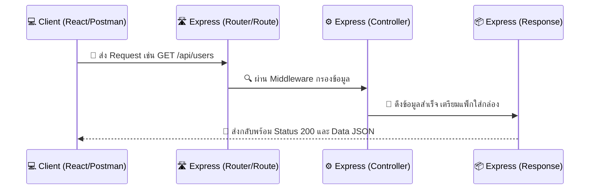

# 🚀 Session 2: Express & API Design

**เวลา:** 10:45 - 12:00 | Building the Backend

---

## 🛠️ สิ่งที่ต้องเตรียมและติดตั้ง (Prerequisites)

ก่อนเริ่ม Session 2 ทุกคนต้องมีเครื่องมือสำหรับสร้างและทดสอบระบบหลังบ้าน (Backend):

1. **Node.js** (มีอยู่แล้วจากตอนทำ Frontend)
   - 🔗 [ดาวน์โหลด Node.js](https://nodejs.org/)
   - ✅ **วิธีตรวจสอบ:** พิมพ์ `node -v` ใน Terminal (ต้องเห็นเวอร์ชัน `v18.x.x` ขึ้นไป)
2. **VS Code** (มีอยู่แล้วจากตอนทำ Frontend)
   - 🔗 [ดาวน์โหลด VS Code](https://code.visualstudio.com/)
   - ✅ **วิธีตรวจสอบ:** ลองกดเปิดโปรแกรม VS Code ขึ้นมา
3. **API Testing Tool:** แนะนำให้ลงโปรแกรม **Postman** เพื่อจำลองเป็นหน้าเว็บยิง API (สำคัญมากเพราะเรายังไม่ได้เขียนหน้าจอ React ให้ต่อกับฝั่งนี้เต็มรูปแบบ)
   - 🔗 [ดาวน์โหลด Postman](https://www.postman.com/downloads/)
   - ✅ **วิธีตรวจสอบ:** ลองกดเปิดโปรแกรม Postman ขึ้นมา (สามารถข้ามหน้า Sign In ไปใช้งานได้เลย)
   - _(ทางเลือก) หากไม่อยากลงโปรแกรมแยก สามารถลง Extension ชื่อ `Thunder Client` ใน VS Code แทนได้_

---

## 💻 Commands สำหรับเริ่มโปรเจกต์ Backend (Setup Commands)

เปิด Terminal หรือ Command Prompt ใหม่ (ไม่ทับกับตัวรัน Vite ของหน้าบ้าน) และรันคำสั่งตามลำดับ:

```bash
# 1. สร้างโฟลเดอร์สำหรับ Backend (ทำในโฟลเดอร์หลักของโปรเจกต์)
mkdir backend
cd backend

# 2. เริ่มต้นโปรเจกต์ Node.js (จะสร้างไฟล์ package.json)
npm init -y

# 3. ติดตั้ง Express (ตัวทำเว็บเซิร์ฟเวอร์หลัก) และ CORS (เอาไว้แก้ปัญหาโดนบล็อกข้ามพอร์ต)
npm install express cors

# 4. ติดตั้ง Nodemon ไว้เป็นตัวช่วยเวลาแก้โค้ดแล้วให้ Server อัปเดตและรันใหม่เอง
npm install -D nodemon
```

_(การตั้งค่าเพิ่มใน package.json)_
ให้เข้าไปที่ไฟล์ `package.json` แล้วเพิ่มคำสั่ง `"dev"` ในหัวข้อ `"scripts"`:

```json
"scripts": {
  "test": "echo \"Error: no test specified\" && exit 1",
  "dev": "nodemon index.js"
}
```

**⚠️ สิ่งสำคัญ:** ก่อนข้ามไปรันเซิร์ฟเวอร์ ให้เราสร้างไฟล์ขึ้นมาชื่อว่า `index.js` ในโฟลเดอร์ `backend` แล้วลองใส่โค้ดตั้งต้นง่ายๆ เพื่อเทสว่า Express ใช้ได้ไหม:

```javascript
// index.js
const express = require("express");
const app = express();
const PORT = 5000;

app.get("/api/test", (req, res) => {
  res.send("Hello World! Backend ทำงานแล้ว 🎉");
});

app.listen(PORT, () => {
  console.log(`🚀 Server starting on port ${PORT}`);
});
```

ลองสั่งรันเซิร์ฟเวอร์ด้วยคำสั่งด้านล่าง:

```bash
npm run dev
```

ถ้าหน้าจอ Terminal พิมพ์ข้อความว่า `� Server starting on port 5000` แสดงว่าระบบพร้อมแล้ว! ลองเปิดเบราว์เซอร์แล้วเข้า URL `http://localhost:5000/api/test` ดูสิครับ จะต้องเห็นคำว่า Hello World เด้งขึ้นมา!

---

## 1️⃣ Express.js Fundamentals

**Backend** เปรียบเสมือน "พ่อครัว/หลังร้าน" คอยรับออเดอร์ (Requests) จากหน้าบ้าน (Front-end) ตรวจสอบความถูกต้องและสั่งงานกับคลังสินค้า (Database) โดยเราใช้ **Express.js** เพื่อทำให้ Node.js สามารถทำหน้าที่หลังร้านนี้ได้ง่ายขึ้นมากๆ

### 🟢 แนวคิด REST API และ HTTP Methods

การส่งคำขอมักใช้ 4 คำสั่งตระกูล CRUD (Create, Read, Update, Delete) ผ่านสิ่งที่เรียกว่า HTTP Methods:

- `GET` : ขออ่าน/ดึงข้อมูล (เช่น ขอข้อมูลผู้ใช้)
- `POST` : ส่งข้อมูลมาใหม่ (เช่น สมัครสมาชิก)
- `PUT`/`PATCH` : ส่งข้อมูลไปเพื่อเปลี่ยนแปลง/แก้ไข
- `DELETE` : คำสั่งลบค่าออกจากระบบ

### 🟢 HTTP Status Codes (รหัสบอกสถานะ)

เมื่อ Backend ตอบกลับ จะแนบตัวเลขมาด้วย เพื่อบอกว่าคำขอนั้นสำเร็จหรือไม่

- `200 OK` : ทำงานเสร็จสมบูรณ์
- `201 Created` : สร้างข้อมูลใหม่สำเร็จ
- `400 Bad Request` : หน้าบ้านส่งข้อมูลมาผิดรูปแบบ
- `401 Unauthorized` : ไม่ได้ล็อกอิน หรือไม่มีสิทธิ์เข้าถึง
- `404 Not Found` : หาหน้าหรือข้อมูลนั้นไม่เจอ
- `500 Server Error` : พังที่ฝั่ง Backend (โค้ดบั๊ก หรือ Database พัง)

### 📊 Diagram แสดง Request Lifecycle



### 💻 ตัวอย่าง Code: การสร้าง Express Server แบบแยกไฟล์ Route ให้เป็นระเบียบ

เพื่อไม่ให้โค้ดทั้งหมดไปกองรวมกันอยู่ใน `index.js` ไฟล์เดียว เราจะแบ่งการทำงานโดยแยก **Routes** ออกไปพักไว้ที่อื่น

1. ให้สร้างโฟลเดอร์ชื่อ `routes` ภายในโฟลเดอร์ `backend`
2. สร้างไฟล์ใหม่ชื่อ `users.js` ไว้ในโฟลเดอร์ `routes`
3. ใส่โค้ดนี้ลงไปในไฟล์ `backend/routes/users.js`:

```javascript
// routes/users.js
const express = require("express");
const router = express.Router();

// จำลองฐานข้อมูลแบบ Array ด่วนๆ สำหรับ Workshop Session 1-2
let fakeDatabase = [
  { id: 1, name: "สมชาย", role: "Admin", department: "IT" },
  { id: 2, name: "สมหญิง", role: "User", department: "HR" },
  { id: 99, name: "ตัวตึง", role: "Super Admin", department: "Management" },
];

// (GET) อ่านข้อมูลทั้งหมด: จะถูกนำไปต่อท้าย /api/users อัตโนมัติ
router.get("/", (req, res) => {
  res.status(200).json(fakeDatabase);
});

// (GET) อ่านข้อมูลเฉพาะ 1 คน
router.get("/:id", (req, res) => {
  const userId = parseInt(req.params.id);
  const foundUser = fakeDatabase.find((user) => user.id === userId);

  if (!foundUser) {
    return res.status(404).json({ error: "ไม่พบผู้ใช้ในระบบ" });
  }

  res.status(200).json(foundUser);
});

// (POST) สร้างข้อมูลใหม่
router.post("/", (req, res) => {
  const newUser = req.body;

  // จำลองการสร้าง ID ใหม่
  const newId =
    fakeDatabase.length > 0
      ? Math.max(...fakeDatabase.map((u) => u.id)) + 1
      : 1;
  const userToSave = { id: newId, ...newUser };
  fakeDatabase.push(userToSave);

  res.status(201).json({
    message: "สร้างผู้ใช้สำเร็จ!",
    data: userToSave,
  });
});

// (PUT) แก้ไขข้อมูล
router.put("/:id", (req, res) => {
  const userId = parseInt(req.params.id);
  const userIndex = fakeDatabase.findIndex((user) => user.id === userId);

  if (userIndex === -1) {
    return res.status(404).json({ error: "ไม่พบผู้ใช้ที่ต้องการแก้ไข" });
  }

  fakeDatabase[userIndex] = { ...fakeDatabase[userIndex], ...req.body };
  res
    .status(200)
    .json({ message: "แก้ไขข้อมูลสำเร็จ!", data: fakeDatabase[userIndex] });
});

// (DELETE) ลบข้อมูล
router.delete("/:id", (req, res) => {
  const userId = parseInt(req.params.id);
  const userIndex = fakeDatabase.findIndex((user) => user.id === userId);

  if (userIndex === -1) {
    return res.status(404).json({ error: "ไม่พบผู้ใช้ที่ต้องการลบ" });
  }

  const deletedUser = fakeDatabase.splice(userIndex, 1);
  res.status(200).json({ message: "ลบผู้ใช้สำเร็จ!", data: deletedUser[0] });
});

module.exports = router;
```

4. จากนั้นกลับมาเปิดไฟล์ `index.js` ตัวหลัก แล้วนำเข้า Router ตัวนั้นมาใช้งาน:

```javascript
// index.js
const express = require("express");
const cors = require("cors");

const app = express();
const PORT = 5000;

// ========================
// 1. เรียกใช้งาน Middleware
// ========================
app.use(express.json()); // สำคัญ! ทำให้ Express อ่านก้อนข้อมูลแบบ JSON ออก
app.use(cors()); // สำคัญ! ยอมให้ React (พอร์ต 5173) เรียกเข้ามาได้

// ========================
// 2. เรียกใช้งาน Routes (ที่แยกไฟล์ไว้)
// ========================
app.get("/", (req, res) => {
  res.send("Hello World! Backend ทำงานแล้ว 🎉");
});

// นำเข้า User Router จากโฟลเดอร์ routes
const userRoutes = require("./routes/users");
// บอก Express ว่า "ถ้ามีใครเรียกขึ้นต้นด้วย /api/users ให้วิ่งไปดูไฟล์ userRoutes แทนนะ"
app.use("/api/users", userRoutes);

// ========================
// 3. สั่งให้ Server เริ่มทำงาน
// ========================
app.listen(PORT, () => {
  console.log(`🚀 Server is running on http://localhost:${PORT}`);
});
```

---

## 2️⃣ Middleware & Common API Bugs

**Middleware** คือ ฟังก์ชันที่เป็น "ตัวกลาง" คอยรับ Request จากหน้าบ้าน ก่อนที่จะส่งต่อไปยังสายด่วน (Route) ของเรา

- **`express.json()`** : Middleware หน้าที่ดักสกัด Body เอามาแปลงเป็น JSON object อัตโนมัติ (ถ้าไม่ใส่ `req.body` จะเป็น undefined เสมอ)
- **`cors()`** : Middleware ทำหน้าที่แปะอนุญาตฝั่งโดเมนอื่นให้ Browser ยอมรับ (กัน CORS Error)

### 💻 ตัวอย่าง Code: การเขียน Custom Middleware (Logger)

เราสามารถกำหนด Middleware ของตัวเองได้ เช่น ทำตัวแจ้งเตือนคอยบอกเราว่ามีคนเรียก API ตรงไหนเวลาใดบ้าง

```javascript
// สร้าง Logger Middleware ประกาศไว้ "ก่อน" ที่จะลงมาถึง Route
const requestLogger = (req, res, next) => {
  console.log(
    `[${new Date().toLocaleTimeString()}] มีการเรียก ${req.method} ที่ ${req.url}`,
  );

  next(); // ⚠️ สำคัญมาก! ต้องเรียก next() เพื่อบอกประตูด่านถัดไปว่า "ผ่านได้"
};

// ใช้งาน Middleware
app.use(requestLogger);
```

### 🚨 Common API Bugs (ปัญหาที่มือใหม่พบบ่อยและวิธีแก้)

> [!WARNING]
>
> - **Error: `Cannot destructure property 'name' of 'req.body' as it is undefined`**
>   - **สาเหตุ:** ลืมใส่ `app.use(express.json());` หรือตั้งค่าให้มันเรียกอยู่หลัง Route
>   - **วิธีแก้:** เอามันไปตั้งไว้บนสุด ก่อนบรรทัดที่มีพวก `app.get`, `app.post`
> - **หน้าจอ Client ค้างโหลดไม่หยุด (Infinite Pending)**
>   - **สาเหตุ:** ลืมสั่ง `res.json(...)` หรือลืมใส่ `next()` ใน Middleware ทำให้ Request ลอยเคว้ง เฝ้ารอตอบกลับแต่ก็ไม่เคยตอบกลับสักที
>   - **วิธีแก้:** ตรวจดูว่า Request นั้นๆ มีคำสั่งลงท้ายด้วยการส่ง `res` เสมอไหม
> - **Error: `Cannot set headers after they are sent to the client`**
>   - **สาเหตุ:** โค้ด Backend สั่งรัน `res.json(...)` หรือ `res.send(...)` ไปให้ Client **"มากกว่า 1 ครั้ง"** ใน 1 Request
>   - **วิธีแก้:** ถ้าใช้ `res.json()` แจ้ง Error บางอย่างใน if แล้ว ให้เพิ่มคำสั่ง `return` ด้วย เพื่อสั่งให้หยุดทำงาน ไม่ลงมารัน `res.json()` ตัวล่างอีก
> - **CORS Error (จากมุมของ Frontend)**
>   - **สาเหตุ:** Frontend ลองต่อ API มาแล้วโดน Browser ฟ้องขัดขวางเพราะ Backend ไม่เปิดรับ
>   - **วิธีแก้:** บรรทัดต้นๆ ต้องใส่ `app.use(cors());` ไว้เปิดเสรีให้ก่อน

---

## 3️⃣ การใช้งาน Postman เบื้องต้นสำหรับทดสอบ API

เมื่อเราสร้าง Backend ด้วย Express.js เสร็จแล้ว แต่ยังไม่มีหน้าเว็บให้กดปุ่ม (React) เราจะใช้ **Postman** ในการจำลองการส่งข้อมูล (Request) ไปหา Express แทน

### 📝 ขั้นตอนการใช้งาน

1. **เปิดโปรแกรม Postman:** ปิดหน้าต่างต้อนรับไปก่อน (ข้ามการ Sign In ด้วยปุ่ม _Skip and go to the app_ ด้านล่างได้)
2. **สร้าง Request ใหม่:** กดเครื่องหมาย `+` กลางหน้าจอเพื่อเปิดแท็บ **New Request**
3. **เลือก HTTP Method:** กดที่ Dropdown (ค่าเริ่มต้นเป็น `GET`) แล้วเลือกให้ตรงกับโค้ดที่เราเขียน เช่น `GET`, `POST`, `PUT`, `DELETE`
4. **กรอกช่อง URL:** พิมพ์ URL ของ Backend ที่สร้างไว้ เช่น `http://localhost:5000/api/users`
5. **(สำคัญ) กรณีใช้ Method POST / PUT:**
   - การสร้าง (`POST`) หรือแก้ไข (`PUT`) จะต้องแนบข้อมูลไปด้วย
   - ให้คลิกที่แท็บ **Body** ลงมาด้านล่าง
   - เลือกตัวเลือก **raw**
   - เปลี่ยนประเภทขวาสุดจาก `Text` หรือ `HTML` ให้เป็น **JSON**
   - กรอกข้อมูล JSON ที่ต้องการส่งไป ตัวอย่าง:

     **ตัวอย่างสำหรับ POST (สร้างผู้ใช้ใหม่):**
     _(ไม่ต้องระบุ `id` เพราะฝั่ง Backend เราเขียนให้มันรันตัวเลขไปเรื่อยๆ เอง)_

     ```json
     {
       "name": "สมหวัง",
       "role": "User",
       "department": "Marketing"
     }
     ```

     **ตัวอย่างสำหรับ PUT (แก้ไขผู้ใช้):**
     _(อย่าลืมระบุ ID ต่อท้าย URL เช่น `http://localhost:5000/api/users/2`)_

     ```json
     {
       "name": "สมหญิง (แก้ไขชื่อ)",
       "role": "Manager"
     }
     ```

6. **กดปุ่ม Send (สีฟ้า):** เพื่อยิงแพ็กเก็ตไปยัง Backend ของเรา
7. **ดูผลลัพธ์ (Response):** ดูในกล่องข้อความด้านล่าง จะเห็นข้อมูลดิบๆ ที่ Express ตอบกลับมา พร้อมกับมีตัวเลข **Status Code** โชว์อยู่ขวามือ (เช่น `200 OK` หรือ `201 Created`)

💡 **ข้อควรระวัง:**

- เช็คทุกครั้งว่าหน้าจอ Terminal ตรง **Backend รันทำงานอยู่ (`npm run dev`) ห้ามปิด** ไม่อย่างนั้น Postman จะโชว์ว่า _Error: Could not get any response / Connection refused_
- ระวังอักขระแปลกปลอม หรือลืมคอมม่า (`,`) ในโครงสร้าง JSON หน้าต่าง Body
