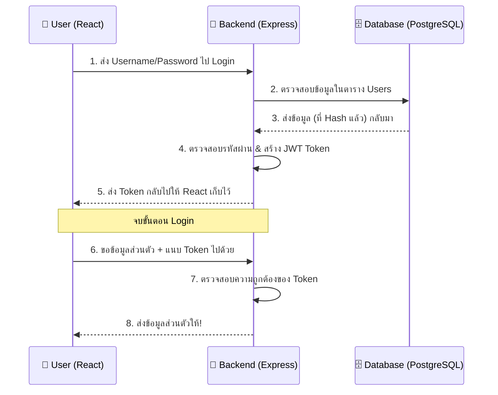

# 🩺 Session 4: Clinic, Show Off & Deployment

**เวลา:** 14:00 - 18:00 | Debug, Practice & Share

---

## 🛠️ สิ่งที่ต้องเตรียมและดาวน์โหลดเสริม (Prerequisites)

ก่อนเริ่มช่วงพัฒนาโปรเจกต์ของตัวเองและการเอาขึ้นโฮสต์จริง ให้เตรียมเครื่องมือเหล่านี้:

1. **Git** - ระบบควบคุมเวอร์ชันโค้ด (เวอร์ชันคอนโทรล)
   - 🔗 [ดาวน์โหลด Git](https://git-scm.com/downloads)
   - ✅ **วิธีตรวจสอบ:** พิมพ์ `git -v` ใน Terminal (ต้องขึ้นชื่อเวอร์ชัน)
2. **GitHub Desktop (แนะนำสำหรับมือใหม่)** - โปรแกรมช่วยจัดการ Git ให้เป็นหน้าต่างคลิกง่ายๆ ไม่ต้องจำคำสั่ง
   - 🔗 [ดาวน์โหลด GitHub Desktop](https://desktop.github.com/)
3. **บัญชี GitHub** - โซเชียลเน็ตเวิร์กของนักพัฒนา เอาไว้ฝากโค้ดฟรี
   - 🔗 [สมัครบัญชี GitHub](https://github.com/)
4. **บัญชี Vercel** - เซิร์ฟเวอร์ฟรีสุดฮิตสำหรับฝากหน้าเว็บ React
   - 🔗 [สมัคร Vercel (ด้วยบัญชี GitHub)](https://vercel.com/)

### 🔧 Tools มีประโยชน์อื่นๆ ที่ควรมีติดเครื่องไว้

- 🔍 **React Developer Tools (Chrome Extension):** แนะนำไปแล้วใน Session 1 (คู่หูนักเขียน React)
- 💅 **JSON Formatter (Chrome Extension):** ทำให้การกดดูข้อมูล JSON บนหน้าเว็บบราวเซอร์ สวยงาม แยกสี อ่านง่ายขึ้นมากๆ
  - 🔗 [ดาวน์โหลด JSON Formatter](https://chromewebstore.google.com/detail/json-formatter/bcjindcccaagfpapjjmafapmmgkkhgoa)
- 🛠️ **Thunder Client (VS Code Extension):** ไว้ใช้ยิง API ภายใน VS Code เลย ไม่ต้องสลับหน้าจอไป Postman

---

## 1️⃣ Deployment (การเอาโค้ดขึ้นระบบใช้งานจริงแบบเซียน)

การจะโชว์ผลงานให้เพื่อนดูได้ เราต้องเอามันขึ้นอินเทอร์เน็ต! สเต็ปสำหรับหน้าบ้านฝั่ง React มีดังนี้

### 🟢 สเต็ปที่ 1: ฝากโค้ดไว้บน GitHub

1. เปิดโปรแกรม **GitHub Desktop** กด Login เข้าสู่บัญชี
2. กดปุ่ม **`Add an Existing Repository from your Hard Drive`** แล้วหาโฟลเดอร์ฝั่ง `frontend`
3. พิมพ์ข้อความว่าทำอะไรไปบ้างในช่อง _Summary_ (ด้านซ้ายล่าง)
4. กดปุ่มสีฟ้า **`Commit to main`** (หมายถึงการ Save จุดเช็คพอยต์)
5. กดปุ่ม **`Publish repository`** ด้านบน เพื่อดันขึ้น GitHub เซิร์ฟเวอร์ ปล. อย่าลืมติ๊ก _Keep this code private_ ออกเพื่อให้คนอื่นดูได้

### 🟢 สเต็ปที่ 2: ให้ Vercel ดึงไปเสิร์ฟ (ทั้ง Frontend และ Backend!)

Vercel ไม่ได้รันได้แค่ React (หน้าบ้าน) เท่านั้น แต่ยังสามารถเอาโปรเจกต์ **Express.js API** (หลังบ้าน) ขึ้นไปรันได้ฟรีด้วย! (ทำงานในรูปแบบ Serverless Functions)

**วิธีเอา Backend (Express.js) ขึ้น Vercel:**

1. ในโฟลเดอร์ฝั่ง `backend` ให้สร้างไฟล์ชื่อ `vercel.json` ควบคู่ไปกับไฟล์ `index.js`
2. ใส่ค่า Configuration ตามนี้ลงในโฟลเดอร์:
   ```json
   {
     "version": 2,
     "builds": [
       {
         "src": "index.js",
         "use": "@vercel/node"
       }
     ],
     "routes": [
       {
         "src": "/(.*)",
         "dest": "index.js"
       }
     ]
   }
   ```
3. ดันโฟลเดอร์ Backend ไปเก็บไว้บน GitHub ตามปกติ (ทำเหมือนสเต็ปที่ 1)
4. ล็อกอินเข้า Vercel กดเลือก **Add New > Project**
5. ดึง Repository ของ Backend เข้ามา
6. (สำคัญสุดๆ) ก่อนกด Deploy ให้เข้าไปที่ **Environment Variables** ก่อน แล้วก๊อปค่าตัวแปรในไฟล์ `.env` (เช่น URL โยงเข้าหา NeonDB) มาใส่ให้ครบ
7. กด **Deploy** โอมเพี้ยง... รอรับลิงก์ Public URL เอาไปแปะให้ React เรียกใช้งานได้ลื่นๆ 🚀

---

## 2️⃣ Debugging Like a Pro (วิถีนักแก้บั๊กแบบมืออาชีพ)

บั๊ก (Bug) เป็นของคู่กับโปรแกรมเมอร์ สิ่งที่แยกระหว่างมือใหม่กับมือโปรคือ **"วิธีสืบหาต้นตอ"**

### 🟢 Flow การสืบค้นคดี 3 ระดับ (เมื่อจู่ๆ หน้าเว็บพังหรือข้อมูลไม่ขึ้น)

1. **ระดับ Browser (Client): สืบที่จุดเกิดเหตุ**
   - **กดคลิกขวา -> `Inspect Elements` -> ไปที่แท็บ `Console`**
     - จ้องหา "ตัวหนังสือสีแดง" ทุกครั้ง
     - บ่อยครั้งจะเจอคำใบ้ เช่น `TypeError: Cannot read properties of undefined` แปลว่าข้อมูลมันยังไม่มาแต่เราฝืนให้เว็บมันโชว์ตัวแปรนั้นแล้ว
   - **แท็บ `Network`**
     - กดรีเฟรชหน้าเว็บ 1 ที -> แล้วคลิกดูรายชื่อ API เส้นที่เป็นสีแดง
     - แอบดูตรงฝั่งขวามือ ไปที่ช่อง `Response` ว่า Backend ส่งคำด่าหรือ Error อะไรกลับมาบอกหรือไม่

2. **ระดับ Express (Backend): สืบที่แคมป์ลูกเสือ**
   - กลับมาดูที่ **Terminal หน้าต่างที่รัน `npm run dev` (ของฝั่ง Node)**
   - สังเกตว่ามันปริ้นท์ (Console.log) อะไรออกมาผิดปกติไหม?
   - โค้ด Backend ต้องมี `try...catch` เพื่อล็อกหน้าตา Error มาโชว์เสมอ ไม่ให้มันดับไปดื้อๆ

3. **ระดับ Database (Data Node): สืบที่คลังสมบัติ**
   - มือใหม่ชอบมึนว่า ตัวเองแก้โค้ดผิด หรือข้อมูลในถังมันผิดกันแน่ ให้เช็คความสบายใจด้วย **Prisma Studio**
   - เปิดอีกวง Terminal ฝั่ง Backend แล้วพิมพ์ `npx prisma studio`
   - มันจะเด้งหน้าจอเว็บ (ปกติคือ `http://localhost:5555`) ที่ทำให้เราคลิกดู แก้ไข ลบ ข้อมูลใน Database ได้เหมือนตาราง Excel ถ้าในนี้ข้อมูลถูกต้อง แต่เว็บ React แสดงผลเพี้ยน... แปลว่าบั๊กอยู่ที่รอยต่อ Express -> React 💯 ยืนยันสมมติฐานได้แคบลง!

---

## 3️⃣ ทริคและปัญหาที่พบบ่อยระดับชาติ (Clinic Guidelines)

> [!WARNING]
> 🚨 **ปัญหา 1: หน้าจอขึ้น `Failed to fetch` หรือ `Network Error`**
>
> - **สาเหตุ:** หน้าเว็บ (เช่น `localhost:5173`) พยายามโทรไปหา Backend (เช่น `localhost:5000`) แต่โทรไม่ติด
> - **เช็คด่วน:** ตรวจดูว่าใน Terminal เปิดรันคำสั่งสั่ง Start ทั้งคู่หรือยัง (แยกเป็น 2 หน้าต่างใน VS Code นะ อย่าสลับไปสลับมารันทีละตัว)
>
> 🚨 **ปัญหา 2: บอท Github แจ้งเตือน Data Leak จากไฟล์ `.env`**
>
> - **สาเหตุ:** เผลอสั่ง Commit และ Push ตัวรหัสผ่านเชื่อม Database ขึ้นโชว์เป็นสาธารณะ
> - **วิธีแก้ระยะยาว:** ไปสร้างไฟล์ `.gitignore` เพิ่มบรรทัด `.env` เข้าไป (ลบไปก่อนแล้วเปลี่ยนรหัส Database ด่วนเพื่อความปลอดภัย)
>
> 🚨 **ปัญหา 3: แก้โค้ด React แต่หน้าจอไม่เปลี่ยน**
>
> - **สาเหตุ:** เผลอกดปุ่ม _Ctrl+S / Cmd+S_ ผิดไฟล์ ไม่ก็โฟลเดอร์ซ้อนกันหลายชั้น เปิดโปรเจกต์ผิดอัน (พบบ่อยมากจริงๆ นึกว่าเปิดไฟล์นี้อยู่ แต่จริงๆ เปิดไฟล์เมื่อวานซืน)
> - **ทริค:** สังเกตจุดกลมๆ บนชื่อแท็บไฟล์ใน VS Code ถ้ามีคือยังไม่ได้ Save!
>
> 🚨 **ปัญหา 4: `Warning: Each child in a list should have a unique "key" prop.`**
>
> - **สาเหตุ:** ตอนที่ React วนลูป (เช่น ใช้ `.map(...)`) เพื่อสร้าง UI ซ้ำๆ มันจะงงถ้าไม่ได้แปะป้ายชื่อไว้
> - **วิธีแก้:** ไปแถมใส่ `key={item.id}` เข้าไปใน HTML Element ตัวบนสุดในลูป

---

## 🔑 Authentication 101 (พื้นฐานระบบสมาชิกและความปลอดภัย)

ก่อนจะทำโปรเจกต์ของตัวเอง หลายคนอาจจะอยากทำระบบสมัครสมาชิก (Sign up) และเข้าสู่ระบบ (Login) นี่คือหลักการทำงานคร่าวๆ ที่ควรรู้:

### 🟢 1. Authentication vs Authorization

- **Authentication (ป้อนบัตรประชาชน):** การยืนยันว่า "คุณคือใคร?" (เช่น การกรอก Username/Password ให้ถูกต้อง)
- **Authorization (บัตรผ่านประตู):** การยืนยันว่า "คุณทำอะไรได้บ้าง?" (เช่น User ทั่วไปดูได้อย่างเดียว แต่ Admin ลบข้อมูลได้)

### 🟢 2. การเก็บรหัสผ่าน (Hashing)

**ห้ามเก็บรหัสผ่านเป็นตัวอักษรธรรมดา (Plain Text) เด็ดขาด!** เพราะถ้า Database รั่ว แฮกเกอร์จะเห็นรหัสของทุกคนทันที

- เราจะใช้เทคนิค **Hashing** โดยใช้ Library อย่าง `bcrypt` เพื่อแปลงรหัสผ่าน "123456" ให้กลายเป็นข้อความมั่วๆ ยาวๆ ที่อ่านไม่ออก และไม่สามารถแปลงกลับเป็นของเดิมได้ง่ายๆ

### 🟢 3. บัตรผ่านดิจิทัล (JSON Web Token - JWT)

เมื่อ Login สำเร็จ Backend จะไม่ส่งรหัสผ่านกลับมา แต่จะส่ง **JWT** หรือ "Token" มาให้

- หน้าบ้าน (React) จะเก็บ Token นี้ไว้ (เช่นใน `localStorage`)
- ทุกครั้งที่ React จะขอข้อมูลส่วนตัวจาก Backend จะต้องแนบ Token นี้ไปใน Header ของ API เสมอ เพื่อบอกว่า "ฉัน Login แล้วนะ นี่คือบัตรผ่านของฉัน"

### 📊 Auth Flow Diagram



---

## 🚀 Summary & Next Steps (ไปต่อที่ไหนดี?)

ขอแสดงความยินดีด้วย! คุณรอดชีวิตจาก **Full-Stack 101 Intensive Course 1 วันเต็ม** คุณได้สัมผัสโครงสร้างของเว็บสมัยใหม่ครบทุกส่วนประกอบ (Browser ↔ React ↔ Express ↔ Prisma ↔ PostgreSQL)
